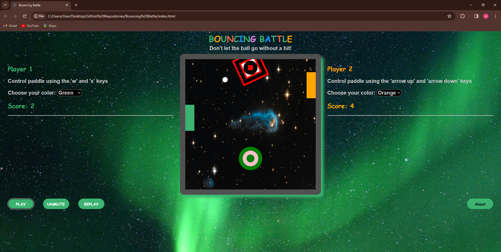

# Bouncing Battle

## Context and Description

This is a Web Based PC Multiplayer Game. Two players control their paddles using keyboard to hit the ball and gain points when opponent misses. For added unpredictability, spinning asteroids fall and deflect the ball. Ball is weightless like ping pong in outer space. You can view a brief **Demo** [here](https://vimeo.com/924799957?share=copy) showcasing gameplay. Bouncing Battle features dynamic visuals, immersive sound effects, and complex ball deflection logic. I did this project to practice Vanilla JavaScript, build something robust with no frameworks or dependencies to convince myself that I was ready to learn React Framework. The features are:

- Two-Player mode
- Customizable Player paddles
- Power ups to increase paddle size
- Falling Obstacles for randomness
- Sound effects for different kinds of impacts
- Energetic Background music to match fast pace gameplay
- Colorful and easy to navigate User Interface
- Pause feature
- Mute feature
- Restart/replay feature

## How to run

- Ensure you have a modern web browser installed
- Open the index.html file in your web browser
- The project should now be visible in your browser
- You can also visit the live site URL [here](https://arinzegit.github.io/Bouncing-Battle-Game/)

## Technologies used

- HTML
- CSS
- JavaScript

## Challenges faced during development

- Retaining a player's power up during game pause was a problem because the setTimeout function used to allocate 10seconds of power up does not have a native pausing syntax or capability.
  - I had to brainstorm and write a pauseSetTimeout function.
- Determining the direction of deflection of the ball on collision with spinning asteroid was a challenge
  - I had to write functions that detect collision and deflect ball from spinning asteroid in a natural manner.

## Third-Party Assets Attribution

- "TRANCER" by Gunnar Olsen (Licensed under [CC-BY 3.0](https://creativecommons.org/licenses/by/3.0/))
- "MUSIC BOX GAME OVER II" by Kim Lightyear (Licensed under [CC-BY 3.0 ](https://creativecommons.org/licenses/by/3.0/))
- "BAD SOUND #2" by Remaxim (Licensed under [GPL 2.0](https://www.gnu.org/licenses/old-licenses/gpl-2.0.html), [GPL 3.0](https://www.gnu.org/licenses/gpl-3.0.html), [CC-BY-SA 3.0](https://creativecommons.org/licenses/by-sa/3.0/))

## Licensing Information

This game is licensed under the GNU General Public License version 3.0 ([GPL 3.0](https://www.gnu.org/licenses/gpl-3.0.html)). You are free to use, modify, and distribute this game under the terms of the GPL 3.0 license.

## Contact

Developer Name: Arinzechukwu Dennings Owoh (Arinze)  
[Email](mailto:arinzeowoh@gmail.com), [GitHub](https://github.com/ArinzeGit), [LinkedIn](https://www.linkedin.com/in/dennings-owoh-4839971b1/), [Instagram](https://www.instagram.com/_.arinze._/), [Twitter](https://twitter.com/Arinze98433402)
